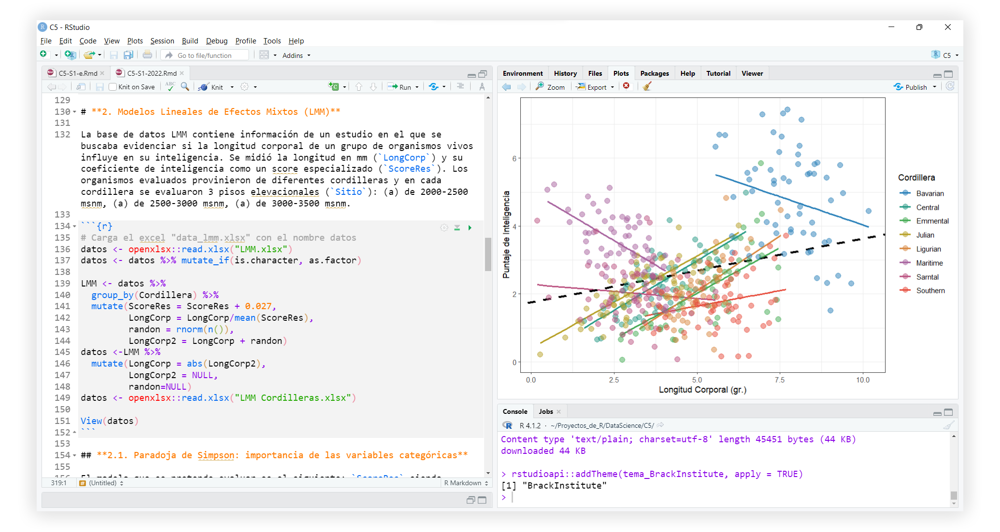
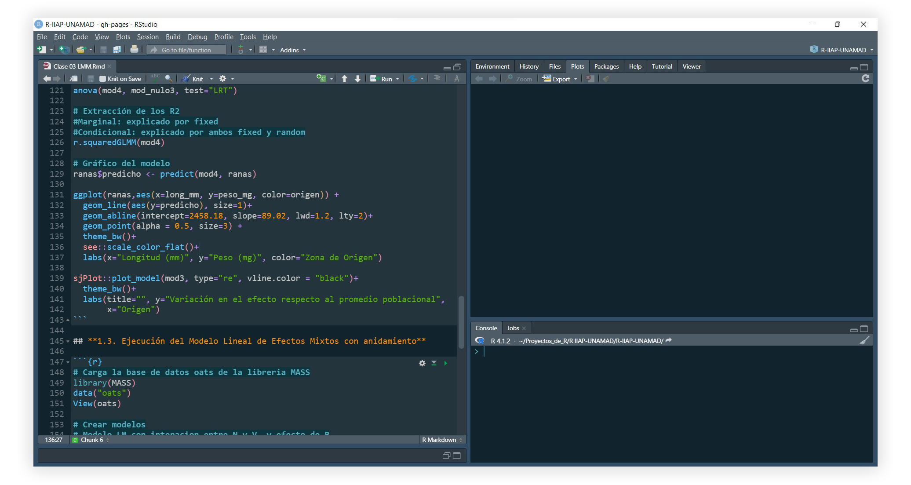

# Temas de RStudio

Este repo es para publicar los temas de RStudio creados para las clases del [Instituto de Ciencias Antonio Brack](https://www.brackinstitute.com/). Son temas sencillos y distintivo para visualizar el código sin cansarse demasiado, con colores diferenciales para las diferentes partes del código.

## Instalación

Necesitarás la versión de RStudio version 1.2. o más reciente. Descarga [la versión más reciente aquí](https://www.rstudio.com/products/rstudio/download/preview/).

Ejecuta el siguiente código en un script de RStudio para descargar, instalar y aplicar el tema. 

### Tema BrackInstitute (2022)



```r
install.packages("rstudioapi")
tema_BrackInstitute <- fs::path_temp("tema_BrackInstitute", ext = "tmTheme")
download.file("https://raw.githubusercontent.com/irwingss/Primolius-Theme/main/BrackInstitute.tmTheme",tema_BrackInstitute)
rstudioapi::addTheme(tema_BrackInstitute, apply = TRUE)
```

### Tema Primolius Claro (2021)


```r
install.packages("rstudioapi")
tema_Primolius <- fs::path_temp("tema_Primolius", ext = "rstheme")
download.file("https://raw.githubusercontent.com/irwingss/Primolius-Theme/main/Primolius_Color.rstheme",tema_Primolius)
rstudioapi::addTheme(tema_Primolius, apply = TRUE)
```

### Tema Primolius Oscuro (2021)



```r
install.packages("rstudioapi")
tema_Primolius_D <- fs::path_temp("tema_Primolius_dark", ext = "rstheme")
download.file("https://raw.githubusercontent.com/irwingss/Primolius-Theme/main/Primolius_Dark.rstheme", tema_Primolius_D)
rstudioapi::addTheme(tema_Primolius_D, apply = TRUE)
```
