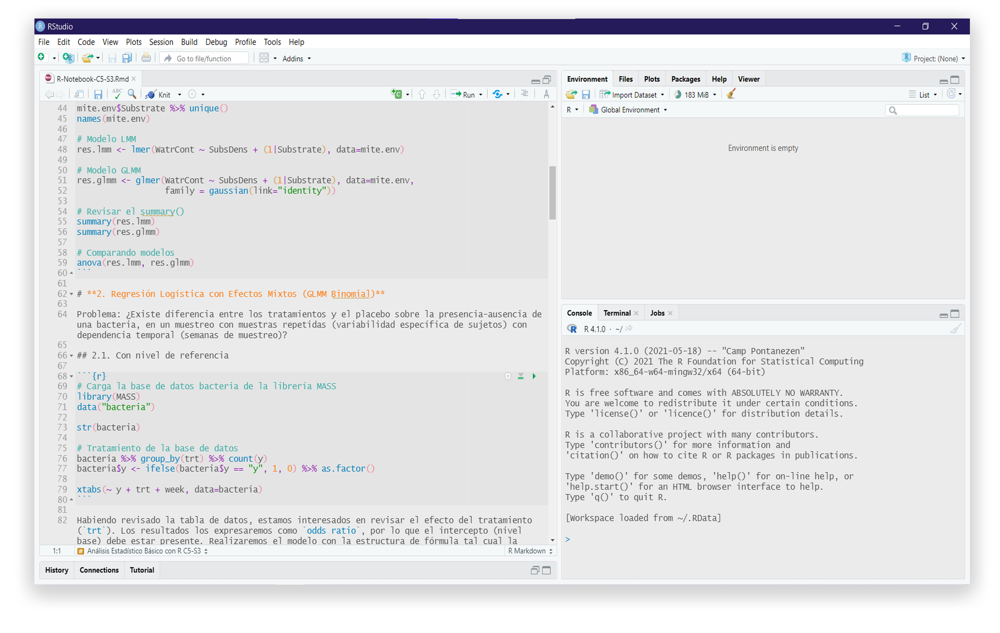

# Tema Primolius

Un tema claro, sencillo y distintivo para visualizar el código sin cansarse demasiado. Este es el tema oficial del grupo [RLatinoamérica](https://web.facebook.com/groups/686154108929440) en 2020-2021, del [Instituto de Ciencias Antonio Brack](https://www.brackinstitute.com/).



## Instalación

Necesitarás la versión de RStudio version 1.2. o más reciente. Descarga [la versión más reciente aquí](https://www.rstudio.com/products/rstudio/download/preview/).

Ejecuta el siguiente código en un script de RStudio para descargar, instalar y aplicar el tema. 

### Tema Claro
```r
tema_Primolius <- fs::path_temp("tema_Primolius", ext = "rstheme")
download.file("https://raw.githubusercontent.com/irwingss/Primolius-Theme/main/Primolius_Color.rstheme",tema_Primolius)
rstudioapi::addTheme(tema_Primolius, apply = TRUE)
```

### Tema Oscuro
```r
tema_Primolius <- fs::path_temp("tema_Primolius", ext = "rstheme")
download.file("https://raw.githubusercontent.com/irwingss/Primolius-Theme/main/Primolius_Color.rstheme",tema_Primolius)
rstudioapi::addTheme(tema_Primolius, apply = TRUE)
```
